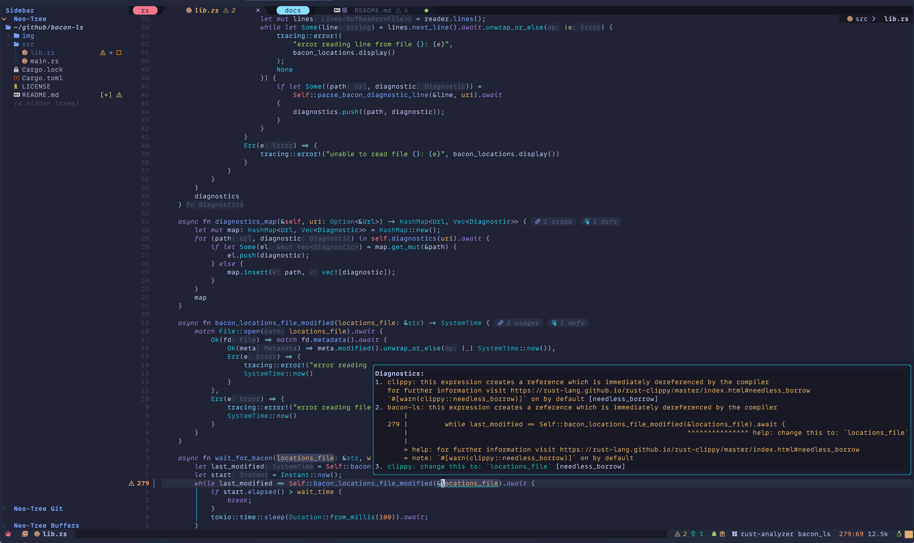

# 🐽 Bacon Language Server 🐽

[](https://github.com/crisidev/bacon-ls/actions?query=workflow%3Aci)
[](https://github.com/crisidev/bacon-ls/actions?query=workflow%3Arelease)
[](https://crates.io/crates/bacon-ls)
[](https://crates.io/crates/bacon-ls)
[](https://github.com/crisidev/bacon-ls/blob/main/LICENSE)
[](https://codecov.io/github/crisidev/bacon-ls)

**Are you tired of [rust-analyzer](https://rust-analyzer.github.io/) diagnostics being slow?**

LSP Server wrapper for the exceptional [Bacon](https://dystroy.org/bacon/) exposing [textDocument/diagnostic](https://microsoft.github.io/language-server-protocol/specification#textDocument_diagnostic) and [workspace/diagnostic](https://microsoft.github.io/language-server-protocol/specification#workspace_diagnostic) capabilities.

`bacon-ls` 🐽 does not substitute `rust-analyzer`, it's a companion tool that can help with large 
codebases where `rust-analyzer` can become slow dealing with diagnostics. 

**`bacon-ls` 🐽 does not help with completion, analysis, refactor, etc... For these, `rust-analyzer` must be running.**



<!-- vim-markdown-toc Marked -->

* [Features](#features)
    * [Limitations](#limitations)
* [Installation](#installation)
    * [VSCode](#vscode)
    * [Mason.nvim](#mason.nvim)
    * [Manual](#manual)
    * [Nix](#nix)
* [Configuration](#configuration)
    * [Choosing a backend](#choosing-a-backend)
    * [Cargo backend options](#cargo-backend-options)
    * [Live diagnostics as you type (cargo backend only)](#live-diagnostics-as-you-type-(cargo-backend-only))
    * [Bacon backend options](#bacon-backend-options)
    * [Manually triggering diagnostics](#manually-triggering-diagnostics)
    * [Changing configuration at runtime](#changing-configuration-at-runtime)
* [Migrating from 0.26.x and earlier](#migrating-from-0.26.x-and-earlier)
* [Editor setup](#editor-setup)
    * [Neovim - LazyVim](#neovim---lazyvim)
    * [Neovim - Manual](#neovim---manual)
    * [VSCode](#vscode)
    * [Coc.nvim](#coc.nvim)
    * [Helix](#helix)
* [Troubleshooting](#troubleshooting)
    * [Bacon preferences](#bacon-preferences)
    * [Vim - Neovim](#vim---neovim)
    * [VSCode](#vscode)
* [How does it work?](#how-does-it-work?)
* [Thanks](#thanks)
* [Roadmap to 1.0 - ✅ done 🕖 in progress 🌍 future](#roadmap-to-1.0---✅-done-🕖-in-progress-🌍-future)

<!-- vim-markdown-toc -->

See `bacon-ls` 🐽 blog post: https://lmno.lol/crisidev/bacon-language-server

`bacon-ls` 🐽 is meant to be easy to include in your IDE configuration.


## Features

* Two backends to produce diagnostics:
  * **Cargo** (default since 0.23.0): runs `cargo check` (or `cargo clippy`) directly with
    JSON output, parses the messages and publishes them. Faster, lighter and zero
    extra dependencies.
  * **Bacon**: reads the export file produced by [Bacon](https://dystroy.org/bacon/)
    and publishes those diagnostics. Useful when you already have `bacon` running.
* Push diagnostics to the LSP client on file save, open, close and rename.
* Precise diagnostic positions and macro-expanded spans pointed back at the
  call-site.
* Replacement code actions as suggested by `cargo` / `clippy`.
* Unused / dead / deprecated code tagged with the LSP `UNNECESSARY` and
  `DEPRECATED` diagnostic tags (cargo backend only) so editors render
  unused variables and imports faded, and deprecated items struck through.
* Streaming partial publishes during a long `cargo` run (configurable refresh
  interval) so the editor lights up as soon as the first errors are known.
* Manual `bacon_ls.run` LSP command to re-trigger a check on demand.
* Bacon backend extras: automatic validation of `bacon` preferences, optional
  creation of the preferences file, optional automatic background `bacon`
  process (requires `bacon` 3.8.0), open-file diagnostic synchronization.
* Support for [cargo workspaces](https://doc.rust-lang.org/book/ch14-03-cargo-workspaces.html).

### Limitations

* Windows support is not tested and probably broken - [#10](https://github.com/crisidev/bacon-ls/issues/10)

## Installation

### VSCode

First, install [Bacon](https://dystroy.org/bacon/#installation).

The VSCode extension is available on both VSCE and OVSX:

* `VSCE` [https://marketplace.visualstudio.com/items?itemName=MatteoBigoi.bacon-ls-vscode](https://marketplace.visualstudio.com/items?itemName=MatteoBigoi.bacon-ls-vscode)
* `OVSX` [https://open-vsx.org/extension/MatteoBigoi/bacon-ls-vscode](https://open-vsx.org/extension/MatteoBigoi/bacon-ls-vscode)

### Mason.nvim

Both Bacon and Bacon-ls are installable via [mason.nvim](https://github.com/williamboman/mason.nvim):

```vim
:MasonInstall bacon bacon-ls
```

### Manual

First, install [Bacon](https://dystroy.org/bacon/#installation) and `bacon-ls` 🐽

```bash
❯❯❯ cargo install --locked bacon bacon-ls
❯❯❯ bacon --version
bacon 3.8.0  # make sure you have at least 3.8.0
❯❯❯ bacon-ls --version
0.14.0        # make sure you have at least 0.14.0
```

### Nix

Both [bacon](https://github.com/Canop/bacon/blob/main/flake.nix) and [bacon-ls](./flake.nix) can be consumed from their Nix flakes.

## Configuration

`bacon-ls` 🐽 reads its configuration from the `bacon_ls` section of the LSP
client settings. All fields are optional — if you provide nothing the cargo
backend starts with sensible defaults. The complete schema is:

```jsonc
{
  "bacon_ls": {
    // "cargo" or "bacon". Optional — see "Choosing a backend" below.
    "backend": "cargo",

    "cargo": {
      "command": "check",                 // "check" or "clippy"
      "features": [],                     // cargo --features list, ["feat1", "feat2"] or "all"
      "package": null,                    // cargo -p <package>
      "allTargets": false,                // cargo --all-targets
      "extraArgs": [],                    // appended verbatim after the cargo command
      "env": {},                          // extra environment variables (string -> string)
      "cancelRunning": true,              // cancel an in-flight run when a new one is triggered
      "refreshIntervalSeconds": 1,        // partial publish interval; null/negative = wait until done
      "separateChildDiagnostics": null,   // override "related information" support; null = follow client
      "checkOnSave": true,                // trigger cargo on textDocument/didSave
      "clearDiagnosticsOnCheck": false,   // clear existing diagnostics before each run
      "updateOnInsertDebounceMillis": 500 // debounce for live diagnostics; updateOnInsert itself is in init_options
    },

    "bacon": {
      "locationsFile": ".bacon-locations",
      "runInBackground": true,
      "runInBackgroundCommand": "bacon",
      "runInBackgroundCommandArguments": "--headless -j bacon-ls",
      "validatePreferences": true,
      "createPreferencesFile": true,
      "synchronizeAllOpenFilesWaitMillis": 2000,
      "updateOnSave": true,
      "updateOnSaveWaitMillis": 1000
    }
  }
}
```

### Choosing a backend

The backend is chosen once, when the server initializes, and cannot be switched
at runtime (you have to restart the server). The choice is resolved as follows:

1. If `bacon_ls.backend` is set to `"cargo"` or `"bacon"`, that wins.
2. Otherwise, if only one of `bacon_ls.cargo` or `bacon_ls.bacon` is present in
   the settings, that backend is selected.
3. Otherwise (both sections present without an explicit `backend`, or no
   settings at all), the default is **cargo**.

Providing both `cargo` and `bacon` sections without an explicit `backend`
key is reported as a configuration error.

### Cargo backend options

Available since `bacon-ls` 0.23.0, default since 0.26.0. Runs cargo directly with
`--message-format=json-diagnostic-rendered-ansi`, parses the stream and publishes
diagnostics — no `bacon` process required.

* `command` (default `"check"`): which cargo subcommand to run. Most useful values
  are `"check"` and `"clippy"`.
* `features`: list of features passed as `--features a,b,c`.
* `package`: when set, passed as `-p <package>` (useful in workspaces).
* `extraArgs`: appended verbatim after the subcommand. Use this for
  e.g. `["--workspace", "--all-targets", "--all-features"]`.
* `env`: map of additional environment variables for the cargo invocation.
* `cancelRunning` (default `true`): when a new run is requested while another is
  still running, cancel the in-flight one. Set to `false` to instead queue at most
  one follow-up run after the current one completes.
* `refreshIntervalSeconds` (default `1`): how often to publish a partial snapshot
  of the diagnostics gathered so far while cargo is still running. The very
  first diagnostic of a run is always published immediately so the editor lights
  up as soon as cargo emits something; this interval governs the cadence of
  refreshes after that. Set to `null` or a negative number to only publish once
  cargo has finished.
* `separateChildDiagnostics` (default `null`): cargo emits some hints as children
  of a parent diagnostic. When `null` we follow the client's
  `relatedInformation` capability; set to `true` to always emit children as
  standalone diagnostics, `false` to always nest them.
* `checkOnSave` (default `true`): trigger a cargo run on `textDocument/didSave`.
  Set to `false` if you only want to drive runs manually via `bacon_ls.run`.
* `clearDiagnosticsOnCheck` (default `false`): publish empty diagnostics for all
  files that previously had any before starting the new run. Useful if you want
  the editor's diagnostic counters to drop to zero immediately at the start of
  a check.
* `updateOnInsertDebounceMillis` (default `500`): when live diagnostics are on
  (see below), how long the server waits after the last keystroke before
  triggering a cargo run against the shadow workspace. Lower values feel
  snappier; higher values reduce the number of cargo invocations during a
  burst of edits.

### Live diagnostics as you type (cargo backend only)

The cargo backend can publish diagnostics on every keystroke instead of
waiting for a save. This is opt-in and turned off by default: when it's off,
the server doesn't even ask the editor for change events.

How it works: on the first dirty buffer, `bacon-ls` builds a "shadow"
workspace at `target/bacon-ls-live/shadow/` by hardlinking every
`.gitignore`-respected file from the real workspace. Subsequent keystrokes
write only the dirty buffer's bytes into the shadow (breaking the hardlink
so the real file stays untouched), and a debounced cargo run targets the
shadow with `--target-dir=target/bacon-ls-live/target` and
`--remap-path-prefix=<shadow>=<real>` so diagnostics open the user's source
file rather than a `target/` copy. On `didSave` / `didClose` the file's
shadow entry is replaced with a fresh hardlink to disk.

To enable it the flag has to come through **`initialization_options`**, not
workspace settings. The reason is timing: the LSP `textDocument/didChange`
sync capability has to be advertised statically before workspace
configuration arrives, and clients (Neovim in particular) don't reliably
retrofit already-attached buffers when the server tries to register that
capability dynamically after `initialized`.

For Neovim's `vim.lsp.config`:

```lua
vim.lsp.config('bacon-ls', {
    init_options = {
        cargo = { updateOnInsert = true },
    },
    settings = {
        bacon_ls = {
            backend = "cargo",
            cargo = {
                command = "clippy",
                -- updateOnInsert lives in init_options above; only the
                -- runtime knob lives here:
                updateOnInsertDebounceMillis = 500,
            },
        },
    },
})
```

For LazyVim:

```lua
bacon_ls = {
    enabled = true,
    init_options = {
        cargo = { updateOnInsert = true },
    },
    settings = {
        bacon_ls = {
            backend = "cargo",
            cargo = {
                command = "clippy",
                updateOnInsertDebounceMillis = 500,
            },
        },
    },
},
```

Tradeoffs and caveats:

* **Linux-first.** Hardlinking and `--remap-path-prefix` work cross-platform,
  but the integration tests cover Linux only. Mileage on macOS/Windows may
  vary.
* **Separate target directory.** The shadow run uses its own
  `target/bacon-ls-live/target/` so the live cargo invocation doesn't
  invalidate caches for the real `cargo build` you might run in a terminal.
  Cost: extra disk space (typically the size of one debug build).
* **First run is cold.** Building the shadow workspace and the
  separate-target cargo cache is a one-shot cost that can take a few seconds
  on a large project. Subsequent runs are incremental.
* **No filesystem watcher.** Files added or deleted on disk while the editor
  is open won't be reflected in the shadow until the next time the server
  rebuilds it (currently: an LSP restart). Touching a file you've already
  opened works, because we mirror its dirty state through `didChange`.
* **`.gitignore` is respected.** The shadow walker uses the same logic as
  ripgrep (`ignore` crate) with `require_git(false)`, so non-git workspaces
  are handled too. Hidden files (`.cargo/`, `.git/`, etc.) are skipped.

This feature complements rather than replaces `rust-analyzer`: keeping
`rust-analyzer` running alongside (with its own diagnostics turned off, see
the editor setup sections) gives you completion, hover, and go-to-definition
on top of bacon-ls's live diagnostics.

### Bacon backend options

Reads diagnostics from the file produced by Bacon's `export-locations` feature.
Configure Bacon with the `bacon-ls` 🐽 export format in the `bacon` preference
file (`bacon --prefs` shows where it lives):

```toml
[jobs.bacon-ls]
command = [
  "cargo", "clippy",
  "--workspace", "--all-targets", "--all-features",
  "--message-format", "json-diagnostic-rendered-ansi",
]
analyzer = "cargo_json"
need_stdout = true

[exports.cargo-json-spans]
auto = true
exporter = "analyzer"
line_format = """\
  {diagnostic.level}|:|{span.file_name}|:|{span.line_start}|:|{span.line_end}|:|\
  {span.column_start}|:|{span.column_end}|:|{diagnostic.message}|:|{diagnostic.rendered}|:|\
  {span.suggested_replacement}\
"""
path = ".bacon-locations"
```

`bacon` itself must be running to keep the export file fresh
(`bacon -j bacon-ls`). When `runInBackground` is `true` (the default since
0.10.0), `bacon-ls` starts and supervises it for you.

* `locationsFile` (default `".bacon-locations"`): bacon export file to read.
* `runInBackground` (default `true`): start `bacon` automatically and tear it
  down on shutdown.
* `runInBackgroundCommand` (default `"bacon"`): command to spawn. Override if
  `bacon` is not in `$PATH`.
* `runInBackgroundCommandArguments` (default `"--headless -j bacon-ls"`):
  command-line arguments passed to the background `bacon` process.
* `validatePreferences` (default `true`): verify the bacon preferences file
  contains a working `bacon-ls` job and matching export configuration. Errors
  are surfaced to the LSP client.
* `createPreferencesFile` (default `true`): if validation fails because the
  preferences file is missing, generate one with the `bacon-ls` job and export
  defined.
* `synchronizeAllOpenFilesWaitMillis` (default `2000`): how often the background
  loop re-publishes diagnostics for every open file (so a fix in file A also
  clears the now-stale error in file B).
* `updateOnSave` (default `true`): re-publish diagnostics on
  `textDocument/didSave`.
* `updateOnSaveWaitMillis` (default `1000`): delay before reading the locations
  file after a save, to give bacon time to finish its run.

### Manually triggering diagnostics

`bacon-ls` 🐽 registers a single `workspace/executeCommand` named `bacon_ls.run`.
Invoking it triggers an immediate cargo run when the cargo backend is active
(the bacon backend ignores it — there is nothing for it to drive directly).

This is how clients can offer a "run check now" command without relying on save
events. Example from a Neovim mapping:

```lua
vim.keymap.set("n", "<leader>cb", function()
  vim.lsp.buf.execute_command({ command = "bacon_ls.run" })
end, { desc = "bacon-ls: run check" })
```

### Changing configuration at runtime

`bacon-ls` honours `workspace/didChangeConfiguration` and re-reads its settings,
but with one important constraint: **the backend choice is fixed for the
lifetime of the process**. Trying to switch from `cargo` to `bacon` (or vice
versa) without restarting the server is reported as an error to the client and
ignored. All other options (cargo command, features, bacon update interval, …)
can be changed live.

## Migrating from 0.26.x and earlier

PR [#113](https://github.com/crisidev/bacon-ls/pull/113) reorganised the
configuration into per-backend sections. If you were on 0.26.x or earlier, the
following changes apply:

* `useBaconBackend` is gone. Replace it with either the explicit
  `"backend": "bacon"` or simply by providing a `"bacon": { ... }` section.
* All `runBaconInBackground*`, `validateBaconPreferences`,
  `createBaconPreferencesFile`, `synchronizeAllOpenFilesWaitMillis`,
  `updateOnSave`, `updateOnSaveWaitMillis` and `locationsFile` keys have moved
  inside `bacon_ls.bacon.*` and dropped the `Bacon` prefix where it was
  redundant (e.g. `runBaconInBackground` → `bacon.runInBackground`,
  `validateBaconPreferences` → `bacon.validatePreferences`).
* All cargo-related keys live under `bacon_ls.cargo.*`.
* The backend can no longer be changed live — restart the server to switch.

Old config:

```jsonc
{
  "bacon_ls": {
    "useBaconBackend": true,
    "runBaconInBackground": true,
    "validateBaconPreferences": true,
    "updateOnSave": true
  }
}
```

New equivalent:

```jsonc
{
  "bacon_ls": {
    "backend": "bacon",
    "bacon": {
      "runInBackground": true,
      "validatePreferences": true,
      "updateOnSave": true
    }
  }
}
```

## Editor setup

### Neovim - LazyVim

```lua
vim.g.lazyvim_rust_diagnostics = "bacon-ls"
```

### Neovim - Manual

NeoVim requires [nvim-lspconfig](https://github.com/neovim/nvim-lspconfig/) to be configured
and [rust-analyzer](https://rust-analyzer.github.io/) diagnostics must be turned off for `bacon-ls` 🐽
to properly function.

`bacon-ls` is part of `nvim-lspconfig` from commit
[6d2ae9f](https://github.com/neovim/nvim-lspconfig/commit/6d2ae9fdc3111a6e8fd5db2467aca11737195a30)
and it can be configured like any other LSP server works best when
[vim.diagnostics.opts.update_in_insert](https://neovim.io/doc/user/diagnostic.html#vim.diagnostic.Opts)
is set to `true`.

```lua
vim.lsp.config('bacon-ls', {
    settings = {
        bacon_ls = {
            backend = "cargo",
            cargo = {
                command = "clippy",
                checkOnSave = true,
            },
        },
    },
})
```

All runtime settings live under the `settings.bacon_ls` table above. The one
setting that has to be in `init_options` instead is `cargo.updateOnInsert`
(see [Live diagnostics as you type](#live-diagnostics-as-you-type-cargo-backend-only)
for why and the exact shape).

When using [codesettings](https://github.com/mrjones2014/codesettings.nvim)
to manage project local settings

```
vim.lsp.config("*", {
  before_init = function(_, config)
    local codesettings = require("codesettings")
    if config.name == "bacon_ls" then
      local settings = codesettings.local_settings()["_settings"]["bacon_ls"]
      if settings ~= nil then
        config["settings"]["bacon_ls"] = settings
        vim.print(config["settings"]["bacon_ls"])
      end
      return config
    end

    return codesettings.with_local_settings(config.name, config)
  end,
})
```

For `rust-analyzer`, these 2 options must be turned off:

```lua
rust-analyzer.checkOnSave.enable = false
rust-analyzer.diagnostics.enable = false
```

### VSCode

The extension can be configured using the VSCode settings interface.

**It is very important that rust-analyzer `Check On Save` and `Diagnostics` are turned off for `bacon-ls` to work properly:**

* Untick `Rust-analyzer -> general -> Check On Save`
* Untick `Rust-analyzer -> diagnostics -> Enable`

### Coc.nvim

```vim
call coc#config('languageserver', {
      \ 'bacon-ls': {
      \   'command': '~/.cargo/bin/bacon-ls',
      \   'filetypes': ['rust'],
      \   'rootPatterns': ['.git/', 'Cargo.lock', 'Cargo.toml'],
      \   'settings': {
      \    'cargo': {
      \      'cancelRunning': true,
      \    }
      \   }
      \  }
      \ }
\ })
```

### Helix

Extend your `languages.toml` with the following:

```toml
[[language]]
name = "rust"
language-servers = ["rust-analyzer", "bacon-ls"]

[language-server.rust-analyzer.config]
checkOnSave = { enable = false }
diagnostics = { enable = false }

[language-server.bacon-ls]
command = "bacon-ls"

[language-server.bacon-ls.config.bacon_ls]
backend = "cargo"

[language-server.bacon-ls.config.bacon_ls.cargo]
command = "clippy"
```

## Troubleshooting

`bacon-ls` 🐽 can produce a log file in the folder where its running by exporting the `RUST_LOG` variable in the shell:

### Bacon preferences

If the `bacon` preference are not correct, an error message will be published to the LSP client, advising the user to
check the README.

### Vim - Neovim

```bash
❯❯❯ export RUST_LOG=debug
❯❯❯ nvim src/some-file.rs                 # or vim src/some-file.rs
# the variable can also be exported for the current command and not for the whole shell
❯❯❯ RUST_LOG=debug nvim src/some-file.rs  # or RUST_LOG=debug vim src/some-file.rs
❯❯❯ tail -F ./bacon-ls.log
```

### VSCode

Enable debug logging in the extension options.

```bash
❯❯❯ tail -F ./bacon-ls.log
```

## How does it work?

`bacon-ls` 🐽 speaks LSP over STDIO and publishes diagnostics to the client via
`textDocument/publishDiagnostics`. How those diagnostics are produced depends on
the active backend.

**Cargo backend (default).** On each trigger (initial start, file save, or a
manual `bacon_ls.run`), `bacon-ls` runs `cargo check` (or `cargo clippy`) with
`--message-format=json-diagnostic-rendered-ansi` from the project root. The JSON
stream is parsed as it arrives, spans from macro expansions are walked back to
the original call site, and diagnostics are published per file. With
`refreshIntervalSeconds` set, partial snapshots are pushed while cargo is still
running so the editor shows errors as soon as they are known. The previous run
is cancelled when a newer one starts (or queued, depending on `cancelRunning`).

**Bacon backend.** [Bacon](https://dystroy.org/bacon/) runs in a watch loop and
writes diagnostics to its export file (default `.bacon-locations`) using a
custom `line_format`. `bacon-ls` reads that file on save / open / close / rename
events and on a periodic open-file synchronization tick, parses the lines, and
publishes the resulting diagnostics. When `runInBackground` is on, `bacon-ls`
also spawns and supervises the `bacon` process itself.

Both backends share the same code-actions pipeline: when a diagnostic carries a
suggested replacement, it is exposed as a `quickfix` code action via
`textDocument/codeAction`.

## Thanks

`bacon-ls` 🐽 has been inspired by [typos-lsp](https://github.com/tekumara/typos-lsp).

## Roadmap to 1.0 - ✅ done 🕖 in progress 🌍 future

- ✅ Implement LSP server interface for `textDocument/diagnostic` and `workspace/diagnostic`
- ✅ Manual Neovim configuration
- ✅ Manual [LazyVim](https://www.lazyvim.org) configuration
- ✅ Automatic NeoVim configuration
  - ✅ Add `bacon-ls` to [nvim-lspconfig](https://github.com/neovim/nvim-lspconfig/) - https://github.com/neovim/nvim-lspconfig/pull/3160
  - ✅ Add `bacon` and `bacon-ls` to [mason.nvim](https://github.com/williamboman/mason.nvim) - https://github.com/mason-org/mason-registry/pull/5774
  - ✅ Add `bacon-ls` to LazyVim [Rust extras](https://github.com/LazyVim/LazyVim/blob/main/lua/lazyvim/plugins/extras/lang/rust.lua) - https://github.com/LazyVim/LazyVim/pull/3212
- ✅ Add compiler hints to [Bacon](https://dystroy.org/bacon/) export locations - https://github.com/Canop/bacon/pull/187 https://github.com/Canop/bacon/pull/188
- ✅ Support correct span in [Bacon](https://dystroy.org/bacon/) export locations - working from `bacon` 3.7 and `bacon-ls` 0.6.0
- ✅ VSCode extension and configuration - available on the [release](https://github.com/crisidev/bacon-ls/releases) page from 0.6.0
- ✅ VSCode extension published available on Marketplace
- ✅ Add `bacon-ls` to `bacon` website - https://github.com/Canop/bacon/pull/289
- ✅ Smarter handling of parsing the Bacon locations file
- ✅ Faster response after a save event
- ✅ Replacement code actions
- ✅ Validate `bacon` preferences and return an error to the LSP client if they are not compatible with `bacon` - working from `bacon-ls` 0.9.0
- ✅ Create `bacon` preferences file if not found on disk - working from `bacon-ls` 0.10.0
- ✅ Start `bacon` in background based on user preferences - working from `bacon-ls` 0.10.0
- ✅ Synchronize diagnostics for all open files - working from `bacon-ls` 0.10.0
- ✅ Support Helix editor - working from `bacon-ls` 0.12.0
- ✅ Nix flake support
- ✅ Support [cargo workspaces](https://doc.rust-lang.org/book/ch14-03-cargo-workspaces.html) - working from `bacon-ls` 0.14.0
- ✅ Faster native cargo backend - default from `bacon-ls` 0.23.0
- 🌍 Emacs configuration
